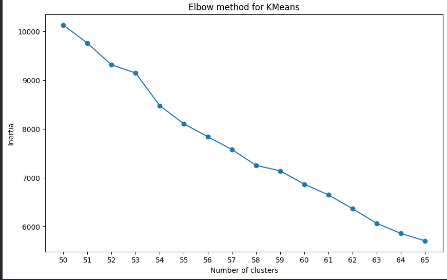

<h1> Customers Segmentation (Kaggle) - ML Python Project</h1>
 
<h2>Features</h2>
<ul>
    <li>Segment customers based on their buying behavior on the market</li>
    <li>Cluster customers on segments based on their behavior using the K-Means algorithm in Python</li>
    <li>Customer segmentation step-by-step from preparing the data to cluster it</li>
    <li>Understand the Dataset & cleanup</li>
    <li>Build a clustering model to segment the customer-based similarity</li>
    <li>Fine-tune the hyperparameters & compare the evaluation metrics of various classification algorithms</li>
    <li>Standardize the values from Quantity & UnitPrice</li>
    <li>Convert cathegorical feature Country to integers</li>
    <li>Plot for the perfect cluster number: Elbow method</li>
    <li>silhouette_score 0.55, above 0.50 is good clustering</li>
</ul>

<h2>Acknowledgments</h2>

<b> Python3: http://bit.ly/python3-certifications </b>
 
<b> Machine Learning: https://bit.ly/machine-learning-certification <b>
 

<h2> Link </h2>
<b> Kaggle: https://www.kaggle.com/datasets/yasserh/customer-segmentation-dataset</b>
 

<h2>Photo</h2>

 
<h2>Contact</h2>

<b> Email: mariusc0023@gmail.com </b>
